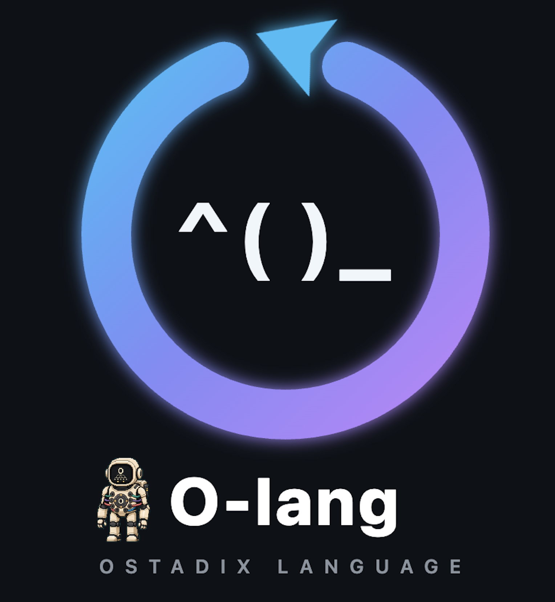

<p align="center">
  
</p>

# Ostadix-lang

*By Lee Ostadi*

[](https://github.com/lostadi/O-lang/actions/workflows/ci.yml)
[](https://github.com/lostadi/O-lang/actions/workflows/fuzz.yml)

> **Every expression carries its own interpreter as part of its syntax.**

Ostadix-lang is a language system built on one
radical idea: the language an expression is written in is a structural part
of the expression itself, not a file extension, not a global mode switch, not
a pragma. You write the language name directly around the code, and the
runtime dispatches to that language's evaluator on the spot.

```O
html^(
  <p>The answer is python^(
__oval_result__ = sum(x*x for x in range(10))
)_python.</p>
)_html
```

The `python^( ... )_python` block is not a string, not a template, not a code
fence. It is an *expression*. Its parenthesis shape, `LANG^(` ... `)_LANG`, is
the syntax that says "evaluate this in Python." The result is an OValue that
HTML can embed directly, without either side knowing about the other's type
system.

Ostadix-lang now has two computation layers that share one project but do different
jobs:

1. **O orchestration**, written in `.O` files, composes real hosted languages,
   persistent environments, deferred computations, Nix operations, and
   operating-system values through typed parentheses and OValue.
2. **O-core**, written in `.oc` files, is the statically typed native systems
   language. It compiles through typed HIR and SSA MIR into freestanding
   x86_64 ELF object files and is capable of building a kernel without Python,
   JSON, subprocesses, a filesystem, libc, or Rust `std` in the target image.

This separation is deliberate. OIR describes orchestration between language
runtimes. O-core MIR describes machine computation, control flow, memory, and
hardware. Hosted blocks such as `python^`, `rust^`, `nix^`, and `sql^` remain
available in user space without becoming kernel dependencies.

**Portability.** Hosted Ostadix-lang is architecture-portable through its
Rust/Cargo, C17, and Python implementations, subject to availability of the
evaluator runtimes used by a program. It has been developed and run on macOS
ARM64, Android ARM64 on a rooted Pixel 8 Pro, and Intel x86_64 Linux. The
current x86_64 limitation applies only to O-core's emitted freestanding ELF
target, not to hosted `.O` execution.

---

## Getting Started: Full Setup Guide

There are three implementations of the hosted `.O` language and one native
compiler path in this repository:

- The **Rust edition** is the authoritative hosted runtime and contains the
  interpreter, REPL, OIR, scheduler, linker tools, notebook, `olangc`, and
  `ocorec`.
- The **C17 edition** is the small standalone hosted runtime and AOT compiler.
- The **Python edition** is the readable reference implementation used for
  semantic cross-checking.
- **O-core** is compiled by the Rust `ocorec` binary, but the code it produces
  is freestanding and has no Rust runtime dependency.

You only need the Rust edition for the full current feature set. The C17 and
Python editions remain useful when you want a smaller substrate or a direct
comparison of the evaluator semantics.

### Prerequisites

The base Rust build needs:

- Rust and Cargo
- A C compiler and system linker
- Python 3 for the `python^` compatibility bridge and Python-backed legacy adapters
- Git and standard POSIX command-line tools

Each hosted backend uses the real local runtime named in the backend table.
You only install the runtimes your `.O` program actually uses. Nix is needed
for the Nix lattice and NixOS tests. Node.js is needed for `javascript^`.
Racket is needed for `racket^`. Rust is needed for `rust^`. The same rule
applies to the other language backends.

The bootable O-core proof additionally needs:

- Clang with the `x86_64-unknown-none-elf` assembler target
- An LLD-compatible linker, either `rust-lld`, `ld.lld`, or Homebrew `lld`
- QEMU for boot verification

The kernel build probes the active Rust toolchain, `PATH`, and common Homebrew
LLD prefixes. If your linker lives somewhere custom, set
`OCORE_LLD=/absolute/path/to/rust-lld-or-ld.lld`.

Python is used by the four-second QEMU smoke-test harness. It is not linked
into the kernel and is not used after the machine starts executing O-core.

### Option A: Automatic setup

The included `setup.sh` script detects the host, installs the ordinary hosted
runtime dependencies, builds the Rust and C17 editions, prepares the Python
reference, and creates convenience wrappers:

```bash
git clone https://github.com/lostadi/O-lang.git Ostadix-lang
cd Ostadix-lang
./setup.sh
```

The script supports several levels of setup:

```bash
./setup.sh --minimal
./setup.sh --full --verify
./setup.sh --full --yes
./setup.sh --no-wrappers
./setup.sh --dry-run
./setup.sh --help
```

`--minimal` skips optional Nix, matplotlib, and extra backend tools. `--full`
adds optional runtimes such as Racket when the operating system package
manager provides them. `--verify` runs the hosted implementations after the
build. Each setup run removes stale generated Ostadix-lang binaries before rebuilding
them, refreshes installed Rust copies in `~/.cargo/bin`, and recreates wrappers
in `~/.local/bin`.

After setup:

```bash
o examples/hello.O
cargo run -- examples/hello.O
./c_cpp/O examples/hello.O ./backends
python3 -m o_lang examples/hello.O
```

### Option B: Manual Rust setup

```bash
git clone https://github.com/lostadi/O-lang.git Ostadix-lang
cd Ostadix-lang
cargo build --release

./target/release/O examples/hello.O backends
./target/release/olangc examples/hello.O -o target/hello
./target/hello
```

### O-Git semantic receipt demo

The smallest O-Git surface is a one-command receipt demo. It lowers one tiny
Ostadix-lang group pipeline to C, runs the compiled artifact, records what semantic
structure survived or disappeared, and shows a policy-aware diff:

```bash
cargo run --bin ogit -- demo semantic-receipt
```

The checked-in source lives in `examples/group_pipeline/main.O`. The generated
C target, visible HTML graph, and DOT graph are written to
`examples/group_pipeline/generated/`, and the receipt is written to
`.ogit/receipts/semantic-receipt-001.json`.

The usual package-manager prerequisites are:

#### macOS

```bash
xcode-select --install
brew install rust python sqlite qemu
cargo build --release
```

#### Debian, Ubuntu, Mint, and Pop!_OS

```bash
sudo apt-get update
sudo apt-get install -y build-essential clang lld python3 python3-pip sqlite3 \
    curl git pkg-config libssl-dev qemu-system-x86
curl --proto '=https' --tlsv1.2 -sSf https://sh.rustup.rs | sh
source "$HOME/.cargo/env"
cargo build --release
```

#### Arch, CachyOS, Manjaro, and EndeavourOS

```bash
sudo pacman -Syu
sudo pacman -S --needed base-devel clang lld python sqlite rustup qemu-full git
rustup default stable
cargo build --release
```

#### Fedora, RHEL, Rocky, and related systems

```bash
sudo dnf groupinstall -y "Development Tools"
sudo dnf install -y clang lld python3 sqlite rustup qemu-system-x86 git openssl-devel pkgconfig
rustup default stable
cargo build --release
```

#### NixOS

```bash
nix-shell -p rustup clang lld python3 sqlite qemu
rustup default stable
cargo build --release
```

#### Other systems

Dedicated setup scripts are provided for Alpine, openSUSE, Void, Gentoo,
FreeBSD, TinyCore, Windows, macOS, Debian, Arch, Fedora, and NixOS under
`setup/os/`. Windows development is best done through WSL2 when the program
needs POSIX backends or the QEMU kernel proof.

### Option C: C17 edition only

The C17 edition requires only a C17 compiler, make, and whatever hosted
language runtimes the program calls:

```bash
cd c_cpp
make
./O ../examples/hello.O ../backends

./olangc ../examples/hello.O -o /tmp/hello-c
/tmp/hello-c
```

The C17 port implements the core typed-parenthesis evaluator, structural
backends, Python execution, the Nix value ladder, lazy and deferred requests,
shebang handling, and AOT packaging. The Rust edition remains authoritative
for OIR planning, coordination-group concurrency, the full backend registry,
the notebook, and O-core.

### Option D: Build and boot O-core

```bash
cargo build --bin ocorec

# Compile one or more O-core modules to an ELF relocatable object.
target/debug/ocorec ocore/examples/minimal.oc --emit obj -o target/minimal.o

# Build the included freestanding kernel.
./ocore/kernel/build.sh

# Boot interactively or run the asserted bootstrap and milestone smoke gates.
./ocore/kernel/run-qemu.sh
./ocore/kernel/smoke-qemu.sh
./ocore/kernel/smoke-faults-qemu.sh
./ocore/kernel/smoke-processes-qemu.sh
./ocore/kernel/smoke-scheduler-qemu.sh
./ocore/kernel/smoke-ipc-foundation-qemu.sh
```

The asserted default `smoke-qemu.sh` output is:

```text
O-core kernel: serial online
page protections: W^X online
page allocator: online
M03 frames: reclaim PASS
M03 frames: zero-reuse PASS
M03 frames: stale-double-free denied
M03 frames: injected-failure rollback PASS
M03 memory objects: typed-generation PASS
address space: online
capability: online
user copy faults: recovered
entry state: CPU-local online
T
CPL3 native[0]: online
user zero-fill: online
capability bounds: denied
forged capability: denied
stale capability: denied
wrong rights: denied
wrong type: denied
closed capability: denied
user ranges: denied
kernel pointer: denied
unknown syscall: denied
register preservation: online
cap_copy reserved: denied
process exit gated: denied
M03 page_alloc: capability online
M03 quota: enforced-recovered
M03 memory stale close: denied
M03 memory lifecycle: PASS
oversized buffer: denied
RFLAGS sanitization: online
timer CPL3 return: online
yield hook: online
CPL3 heartbeat: online
QEMU smoke: PASS
```

The `T` is emitted by the actual IRQ0 timer handler after the IDT, PIC, and
PIT are installed. The smoke gate requires that standalone timer line before a
post-interrupt CPL3 return marker and a later CPL3 heartbeat. User-boundary
markers are emitted by the CPL3 task through the architectural syscall path;
the M0.3 allocator/object markers come from kernel self-tests. Only the final
`QEMU smoke: PASS` line is added by the host harness.

The Milestone 0.2 fault gate performs eight fresh QEMU boots. It covers divide
error, invalid opcode, canonical non-present and supervisor reads, a stack-guard
write, NX instruction fetch, a noncanonical target, and an excluded syscall
return RIP. Each run must mark the scenario's only process `FAULTED`, clear the
current process, and reach a later kernel timer marker. It also performs a ninth
boot with a deliberate leaf-page hole, requires `ERR_USER_COPY_FAULT`, and
observes a later CPL3 heartbeat without faulting the process. This wording is
specific to that bootstrap gate and is not the current kernel ceiling.

Milestone 1 is complete for two bounded native processes on one CPU.
`smoke-processes-qemu.sh` boots independent normal-exit and contained-fault
scenarios and proves separate CR3s, same-VA physical isolation, atomic
PCB/domain/address-space/CSpace switching, split teardown, stale identity
denial, sibling survival, complete dynamic-frame reclamation, and a later timer.

Milestone 2 is complete for four TCBs across two processes on one CPU.
`smoke-scheduler-qemu.sh` proves one million forced identity transactions, FIFO
runnable and blocked queues, two CPU-bound and two sleeping CPL3 threads,
cooperative yield, timer preemption, cross-thread hostile-RFLAGS sanitization,
wake-once sleep, priority/accounting, hostile saved-RSP TCB containment, idle
entry, exit during preemption, sibling progress, stale TCB denial, frame
reclamation, and a post-lifecycle timer. The million-iteration stress installs
and verifies CR3/TSS/GS plus PCB/domain/address-space/CSpace identity and a saved
frame canary without entering CPL3; the separate IRQ/SYSCALL phase proves real
save/IRET context switching.

Milestone 3 has a verified foundation, not a completed IPC gate.
`smoke-ipc-foundation-qemu.sh` proves generation-tagged endpoints with bounded
FIFO/cancellation and waiter-record cleanup, invisible destination reservations,
exact-generation queued-capability escrow, shared-memory-only attenuating
transfers, and an optional fixed RW/NX shared page authorized by each address
space's exact owner CSpace. It proves cross-CR3 visibility, exact attenuation,
failed re-transfer, generation reuse, stale-ticket denial, rejection of new
work from a dead sender, explicit management-harness cancellation of that
sender's earlier queue item and ticket, resource reclamation, and later timer
survival. It does not expose endpoint operations to CPL3 or prove real blocked
IPC, preemptive request/reply, the complete death matrix, or personality-service
crash containment.

### Docker

The Dockerfile builds the hosted `O`, `olangc`, and `o-link` binaries and
packages Python 3 with the core shims. The native O-core compiler and
`o-unlink` remain part of the direct Cargo build:

```bash
docker build -t o-lang .

docker run --rm -v "$PWD:/work" o-lang examples/hello.O
docker run --rm -it o-lang --repl
docker run --rm -v "$PWD:/work" --entrypoint o-link \
    o-lang src/ -o app.O
```

The O-core QEMU proof is intended to run directly on the host because it
needs QEMU and the local Rust linker toolchain.

### What gets built

| Binary | Location | What it does |
|--------|----------|--------------|
| `O` | `target/release/O` | Runs `.O` documents and provides the interactive REPL. |
| `olangc` | `target/release/olangc` | Produces native hosted binaries, WASI modules, script execution, OIR dumps, or Graphviz DOT hypergraph export. |
| `ocorec` | `target/release/ocorec` | Compiles `.oc` modules through AST, typed HIR, and SSA MIR to x86_64 ELF objects. |
| `o-link` | `target/release/o-link` | Safely lifts codebases into route-preserving project bundles, or combines explicit scripts in literal mode. |
| `o-unlink` | `target/release/o-unlink` | Restores safe project bundles and legacy literal link sections. |
| `o-notebook` | feature-gated Cargo binary | Runs the local notebook server when built with `--features notebook`. |
| `O` | `c_cpp/O` | Runs `.O` through the standalone C17 edition. |
| `olangc` | `c_cpp/olangc` | Produces a hosted native executable through the C17 edition. |

### Build artifacts and source-only checkout

The repository tracks source, specifications, tests, examples, the Ostadix-lang
logo, and the intentional mascot assets. It does not track compiled programs,
object files, Python bytecode, fuzz crashes, coverage output, virtual
environments, or compiler caches.

Cargo places Rust products under `target/`. The C17 edition writes `c_cpp/O`,
`c_cpp/olangc`, and `c_cpp/src/*.o`. O-core kernel objects and the linked kernel
also live under `target/ocore-kernel`. The commands in this README place direct
`olangc` and `ocorec` output under `target/` for the same reason. All of these
locations are ignored by Git.

The ignore rules cover:

- Cargo, cargo-fuzz, C, C++, CMake, linker, profiler, and WebAssembly output.
- Root-level generated Ostadix-lang command binaries and the C17 binaries.
- Python `__pycache__`, bytecode, virtual environments, test caches, type-check
  caches, lint caches, and coverage output.
- Default `o-link` output, generated extraction directories, editor state, and
  operating-system metadata.

Uppercase `.O` files are Ostadix-lang source and remain trackable. Lowercase `.o`
files are native objects. On case-folding macOS filesystems Git can treat those
patterns as equivalent, so object rules are scoped to real build directories
instead of using a global `*.o` rule.

To remove local build products without touching source:

```bash
cargo clean
make -C c_cpp clean
rm -rf fuzz/target fuzz/artifacts fuzz/coverage
```

To audit what Git is excluding:

```bash
git status --short --ignored
git check-ignore -v target/release/O c_cpp/O fuzz/artifacts/parser/crash
```

### Verifying the installation

```bash
# Rust unit and binary-target tests
cargo test --all-targets --all-features

# Release CLI contract, including olangc and ocorec object emission
cargo build --release
bash tests/test_cli.sh

# Hosted example suite
bash test_o_lang_examples.sh

# C17 edition
make -C c_cpp test

# Python reference
python3 -m tests.test_parser
python3 -m tests.test_evaluator

# Native boot proof
./ocore/kernel/smoke-qemu.sh
```

---

## Table of Contents

1. [What is new here?](#what-is-new-here)
2. [Related work and how Ostadix-lang differs](#related-work-and-how-ostadix-lang-differs)
3. [Gentle introduction](#gentle-introduction)
4. [Quickstart](#quickstart)
5. [Hosted language tour](#hosted-language-tour)
6. [OValue and the runtime boundary](#ovalue-and-the-runtime-boundary)
7. [Hosted backends](#hosted-backends)
8. [Compiler and composition tools](#compiler-and-composition-tools)
9. [Architecture](#architecture)
10. [O-core native systems language](#o-core-native-systems-language)
11. [Running the tests](#running-the-tests)
12. [Status](#status)
13. [Citation and authorship](#citation-and-authorship)

---

## What is new here?

Most languages make one or all of these assumptions:

* A program is written in one language.
* When you call another language you use an FFI, a bridge bolted on the side.
* The language a piece of code belongs to is determined by the file it sits
  in, or by a special import or escape mechanism.
* Native systems code and orchestration code must share one intermediate
  representation even though they have different semantics.

Ostadix-lang breaks all four assumptions. Here are the five ideas that make it
different.

### 1. Typed parentheses: the language is in the syntax

In every ordinary language, parentheses are anonymous. `(x + y)` is grouping;
nothing about the parentheses tells you what evaluator will handle the
contents.

Ostadix-lang gives parentheses a *type*: the identifier before `^(` names the
evaluator, and the matching `)_IDENT` closes it.

```O
python^( 6 * 7 )_python
html^( <b>hello</b> )_html
markdown^( **bold** )_markdown
nix^( builtins.nixVersion )_nix
sql^( SELECT 40 + 2 AS answer; )_sql
```

These are not escape sequences inside another language. They are first-class
expressions, and they nest freely:

```O
html^(
  <p>Count: python^( sum(range(10)) )_python</p>
)_html
```

The Python expression is evaluated first, its result is converted to
something HTML can embed, and then the HTML expression completes. **No
pairwise FFI. No template bridge. The nesting is the interface.**

### 2. OValue: the universal exchange type

When Python produces `42` and HTML needs to embed it, something has to cross
the boundary. In Ostadix-lang that something is always an `OValue`, a tagged union
that every backend speaks.

```text
ONull | OBool | ONumber | OText | OChar | OHtml
OList | OMap | OSeq | OObject | OEntriesMap | OSet
OSymbol | OKeyword | OScope | OBlob | OBytes | OGraph | OExpr
ONixExpr | ODerivation | OStorePath | OSystem | ONative
ORequest | OThunk | OGroup | OError | OCapability | OSnapshot
```

The critical insight is that **the receiving language decides how to render a
foreign value, not the sending language**. This is the `render_child`
operation: each backend knows how to turn OValue into its own source syntax.

```text
HTML.render_child(OBlob(png, "image/png"))
  -> 

HTML.render_child(OList([OText("a"), OText("b")]))
  -> <ul><li>a</li><li>b</li></ul>

Python.render_child(ONumber::Int(42))
  -> 42
```

With N languages and this single protocol, interoperability costs O(N) code,
one renderer per language, instead of O(N squared) bridges between every
pair. The canonical exchange form is explicit and inspectable rather than
hidden in a compiler pass.

### 3. Explicit persistent environments

Bare hosted expressions are ephemeral. They receive a fresh environment for
that expression and are cleaned up afterward:

```O
python^( x = 10 )_python
python^( x )_python             # x is not retained
```

Persistence is explicit through the environment index:

```O
python[0]^( x = 10 )_python[0]
python[1]^( x = 99 )_python[1]
python[0]^( x * x  )_python[0]  # 100
```

The number in brackets is an environment index. State, imports, functions,
and backend-owned resources survive for the life of the evaluator for every
expression that names the same `(language, index)` pair. Different indices
are isolated from one another.

This gives Ostadix-lang notebook-like state without making the notebook's one global
namespace an invisible part of the language.

### 4. Homoiconicity across languages

Lisp is famous for homoiconicity: code and data have the same shape, so a
program can inspect another program, transform it, and evaluate it. Ostadix-lang
generalizes that idea across multiple languages.

The `quote^` backend captures an O expression as `OExpr` without evaluating
it:

```O
let q = quote^( python^( 6 * 7 )_python )_quote
```

Python can receive `q` as a live `OExprValue` and evaluate it through the
current O evaluator:

```O
python[0]^(
result = O.eval(q)
)_python[0]
```

Python can also construct O source and parse it back into an expression:

```O
python[0]^(
src = "python^(2 ** 10)_python"
result = O.eval(O.quote(src))
)_python[0]
```

The language boundary is not a barrier to metaprogramming. An O expression
can be constructed in one language, moved as data through another, and
evaluated by its named backend later.

`O.eval` uses a lexical snapshot of the O scope visible at the backend call
site. A quoted fragment can read caller `let` bindings, including bindings
created earlier inside the current typed expression. New `let` bindings inside
the fragment remain local to that callback and do not mutate the caller.

Scope capture can also be explicit. `scope()` returns a detached OScope value,
and the two-argument form chooses it instead of the callback-site scope:

```O
let answer = python[2]^(41)_python[2]
let captured = scope()
let answer = python[2]^(99)_python[2]
let q = quote^(python[1]^($answer + 1)_python[1])_quote
python[0]^(O.eval($q, $captured))_python[0]  # 42
```

Python can also call `O.scope()` to capture the current O bindings or
`O.scope({"name": value})` to construct a restricted scope explicitly.

### 5. Orchestration and machine computation have different IRs

Ostadix-lang does not force every kind of computation into the same abstraction.

Hosted `.O` programs lower into OIR. OIR names text, loads, stores, builtin
calls, backend execution, structural dependencies, sequencing dependencies,
and data dependencies. It is the correct representation for scheduling
polyglot work.

Native `.oc` programs lower into typed HIR and then SSA MIR. MIR has typed
values, mutable places, basic blocks, phi nodes, calls, branches, memory
operations, intrinsics, and assembly. It is the correct representation for
machine code.

```text
.O  -> ONode -> OIR -> ExecutionPlan -> hosted evaluators
.oc -> AST -> typed HIR -> SSA MIR -> x86_64 ELF object
```

This is the point where Ostadix-lang becomes both a polyglot meta-language and a
systems programming language without pretending those are the same problem.

---

## Related work and how Ostadix-lang differs

Ostadix-lang sits at the intersection of language-oriented programming, polyglot
execution, metaprogramming, workflow systems, and native systems languages.
The one-sentence thesis is: **the evaluator is named by the delimiter shape,
so language choice becomes a structural property of an expression at any
nesting depth, and distinct runtimes exchange values through OValue while
native computation remains in a separate typed compiler pipeline.**

**Racket `#lang` and language-oriented programming.** Racket pioneered the
idea that a program declares its own language and that defining new languages
should be cheap. The differences are granularity and substrate. `#lang` is a
module-level declaration, and its languages ultimately run through Racket.
Ostadix-lang places the language tag at expression level and dispatches to separate,
real runtimes such as CPython, Nix, Node.js, Rust, SQLite, Racket, and others.
Racket unifies languages through a common host. Ostadix-lang keeps the evaluators
distinct and unifies the values that cross between them.

**Polyglot notebooks and literate programming.** Jupyter, .NET Interactive,
and Org-mode Babel let top-level cells use different languages. Ostadix-lang makes a
language block an expression inside the AST. A Python expression can occur
inside HTML which occurs inside another Python expression. The boundary is a
composable node, not only a cell delimiter. The local O notebook is one UI
over this evaluator, not the definition of the language.

**Staged metaprogramming.** Lisp quotation, MetaOCaml, Template Haskell, and
Terra all make code available as data. Ostadix-lang's generalization is across
backend languages. `OExpr` carries O syntax, `quote^` captures it, and
`O.eval` re-enters the active evaluator.

**String-embedded DSLs.** Heredocs, JSX, tagged templates, and SQL strings
usually leave the embedded language opaque to the host. Ostadix-lang parses the
typed-expression boundary into its AST, evaluates the named backend, and
returns an OValue that the surrounding expression consumes as a first-class
atom.

**Workflow engines.** Deferred requests, content fingerprints, execution
plans, groups, and autonomous scheduling make Ostadix-lang capable of expressing
workflow topology. The difference is that these control values live in the
same value system as the language results. `batch`, `all`, `any`, and `race`
are not external scheduler configuration; they are O expressions.

**The claim, stated exactly.** Individual prior systems provide pieces of
this design. Eco composes languages through arbitrarily nested language boxes,
but it is primarily a language-composition editor. PyHyp provides executable
fine-grained nesting for one specifically engineered language pair. GraalVM
standardizes interoperability across languages implemented within or exposed
through its polyglot substrate. Ostadix-lang's novelty is a *conjunction* of
properties rather than any single one:

1. **Expression-granular evaluator selection.** The evaluator is chosen at the
   level of an individual expression, not a file, module, or cell.
2. **Recursive nestability.** Evaluator expressions may contain other
   evaluator expressions to arbitrary depth.
3. **A registry-extensible evaluator family.** The set of evaluators is a
   compile-time-extensible registry, not a fixed pair. Adding an evaluator
   means adding a registry entry and rebuilding; registration is static, not
   a runtime plugin system.
4. **Independent runtimes.** Evaluators are independently implemented real
   runtimes such as CPython, Node.js, Nix, SQLite, Racket, and rustc, not
   reimplementations on one shared substrate.
5. **A common value domain.** Results cross boundaries through OValue, a
   single language-neutral value type, instead of pairwise foreign-function
   interfaces.
6. **Global lowering.** The full heterogeneous computation lowers into one
   execution representation (OIR and its value-flow graph) for whole-program
   scheduling and analysis.

To our knowledge, Ostadix-lang is the first general-purpose programming system
to combine expression-granular recursive evaluator composition across a
registry-extensible family of independently implemented runtimes with a
language-neutral value boundary and source-derived lowering into a unified
whole-program execution representation. The current Rust implementation
derives, validates, analyzes, and executes a directed state-complete HGraph.
Arbitrary hosted effects remain conservative: unknown operations are serialized
through `HostWorld`, persistent evaluator state is carried by actor-state
tokens, and worker dispatch is restricted to verified pure inline renderers.
The serial OIR executor remains the differential oracle. Wherever a
prior system satisfies part of this
conjunction, the paragraphs above and below say so; corrections and closer
prior art are welcome as issues.

**Systems languages.** C, Rust, Zig, and freestanding subsets of other
languages already compile kernels. O-core's distinct point is its placement
inside Ostadix-lang's two-level model. Hosted O can generate, compose, build, boot,
and inspect native O-core while O-core itself stays free of the hosted runtime
and its dependencies.

Ostadix-lang is now an implemented toolchain rather than only an organizing idea.
The repository contains the parser, evaluator, OValue protocol, persistent
process registry, OIR and execution planner, scheduler and disk cache, real
hosted backends, native and WASI packaging, linker and unlinker, notebook,
static O-core front end, SSA lowering, x86_64 object generation, freestanding
runtime, and an asserted QEMU boot. The current boundaries are documented at
the end of this README as concrete engineering scope, not as placeholders for
features that already exist.

---

## Gentle introduction

*This section is for readers who are new to programming languages as objects
of study. You do not need prior experience with compilers, interpreters, or
kernel development. You need only curiosity.*

### What is a programming language, really?

When you write `2 + 2` in Python and run it, something has to interpret those
characters and produce the number `4`. That something is an evaluator. Every
programming language is, at bottom, a pair of things:

1. **Syntax**, the rules about what text is a valid program.
2. **Semantics**, the rules about what a valid program does.

Most of the time, you pick one language and use its evaluator for the whole
file.

Ostadix-lang changes the unit at which that choice is made. The evaluator belongs to
the expression:

```O
python^(
1 + 1
)_python
```

Read this as: "evaluate this body in Python." The opener and closer are a
matched pair. Everything between them is Python source.

### Nested expressions

Now place a Python block inside HTML:

```O
html^(
  <h1>The answer is python^(
6 * 7
)_python!</h1>
)_html
```

The evaluator works inside-out, leaves before roots, like arithmetic. Python
produces `42`. The HTML backend receives the value, renders it as HTML-safe
content, and produces:

```html
<h1>The answer is 42!</h1>
```

No string interpolation library is needed. The nesting is the template.

### Naming values

```O
let answer = python^( 40 + 2 )_python

python^(
$answer + 1
)_python
```

The first expression binds an ONumber integer to `$answer`. The receiving
Python backend renders that number as the Python literal `42`, so the second
block evaluates `42 + 1`.

### Persistent state when you ask for it

```O
python[0]^(
import random
random.seed(42)
samples = [random.gauss(0, 1) for _ in range(500)]
)_python[0]

python[0]^(
round(sum(samples) / len(samples), 4)
)_python[0]
```

The `[0]` is what makes the Python process persistent. A bare Python block is
single-use. This distinction keeps state visible in the source.

### Native computation

The hosted language is about composing evaluators. O-core is what you use
when the computation itself must become freestanding machine code:

```ocore
module example;

struct Point {
    x: i64,
    y: i64,
}

fn sum(point: *const Point) -> i64 {
    unsafe {
        return (*point).x + (*point).y;
    }
}
```

The source is parsed, resolved, statically checked, lowered through typed HIR
and SSA MIR, and emitted as an ELF object. There is no backend interpreter in
the resulting target code.

---

## Quickstart

### Run a hosted O program

```bash
cargo build
cargo run -- examples/hello.O
```

### Use the REPL

```bash
cargo run -- --repl backends
```

The REPL keeps O-level `let` bindings and explicit backend environments alive
between entries. It supports multiline typed expressions, history, scope
inspection, reset, and terminal-aware output.

### Use the local notebook

```bash
cargo run --features notebook --bin o-notebook -- backends
```

The notebook listens on `127.0.0.1:8888`, opens a local browser, and keeps one
evaluator session across cells. It renders HTML and image OValues directly,
supports cell reordering and run-all, saves and loads notebook JSON, and can
restart the evaluator state.

### Compile hosted O

```bash
cargo run --bin olangc -- examples/hello.O -o target/hello
./target/hello

cargo run --bin olangc -- examples/hello.O --target script
cargo run --bin olangc -- examples/hello.O --target ir
cargo run --bin olangc -- examples/hello.O --target dot
cargo run --bin olangc -- examples/hello.O --target dot | dot -Tpng -o graph.png
```

### Compile O-core

```bash
cargo run --bin ocorec -- kernel.oc --emit hir -o -
cargo run --bin ocorec -- kernel.oc --emit mir -o -
cargo run --bin ocorec -- kernel.oc --emit obj --keep-asm -o target/kernel.o
```

### Link source into one O document

```bash
# Explicit files retain the sequential typed-block linker.
cargo run --bin o-link -- calc.py page.html app.O -o target/program.O
cargo run -- target/program.O

# One directory is lifted safely as a route-preserving project bundle.
cargo run --bin o-link -- src/ -o target/project.O
cargo run --bin o-link -- --list-routes target/project.O

cargo run --bin o-unlink -- target/project.O -o target/restored/
```

---

## Hosted language tour

### Typed expression syntax

```text
LANG^( body )_LANG
LANG[n]^( body )_LANG[n]
LANG{lazy}^( body )_LANG{lazy}
LANG[n]{defer}^( body )_LANG[n]{defer}
```

The opener and closer must match exactly as written. The language name must be
registered. An identifier that is not a registered language remains ordinary
text even when followed by `^(`, which prevents inner-language operators from
being mistaken for O syntax.

The parser recognizes backslash escapes for literal O openers, closers, and
splices. Inside a Bash block, write `\$PATH` when you want the backend to
receive the literal shell expression `$PATH` rather than an O-level splice.

#### Aliases

| Alias | Canonical language |
|-------|--------------------|
| `py` | `python` |
| `md` | `markdown` |
| `tex` | `latex` |
| `plain` | `text` |
| `o` | `O` |

Aliases retain their source spelling in the closer but resolve to the same
backend and environment namespace.

#### Shebang support

Executable O documents may begin with:

```text
#!/usr/bin/env o
```

The interpreter, compiler, linker, and unlinker handle the shebang as part of
the source-file workflow.

### `let` bindings and `$var` splicing

```O
let name = LANG^( ... )_LANG
```

The expression is evaluated and its OValue is stored in the O-level scope.
When `$name` appears inside another expression, the receiving backend renders
that OValue in its own syntax.

```O
let answer = python^( 40 + 2 )_python
html^( <p>The answer is $answer.</p> )_html
```

### Python result rules

A Python block chooses its result in this order:

1. The value assigned to `__oval_result__`.
2. The value of the final bare expression.
3. Captured stdout when neither of the first two produces a value.

```O
python^( 6 * 7 )_python
python^( print("hi") )_python
python^( __oval_result__ = 99 )_python
```

Python values are converted recursively into OValue, including booleans,
integers, floats, strings, lists, maps, bytes, HTML, store paths, expressions,
and image blobs.

### `O^(...)_O` sequencing

The `O` backend is the structural document host. It evaluates children from
left to right and returns the last non-null value:

```O
O^(
  python[0]^( x = 10 )_python[0]
  python[0]^( x * x  )_python[0]
)_O
```

Because `O` controls child evaluation directly, it is implemented as an
inline AST backend rather than as a subprocess shim.

### Environment lifetime

```O
python^( x = 40 )_python
python^( x + 2 )_python        # fresh environment, x is absent

python[0]^( x = 40 )_python[0]
python[0]^( x + 2 )_python[0] # 42
python[1]^( x )_python[1]     # isolated environment
```

The Rust runtime uses an internal ephemeral environment identifier for bare
blocks and destroys that backend process after the expression. An explicit
numeric identifier names a persistent `(language, environment)` process.

### Lazy and deferred blocks

`{lazy}` and `{defer}` capture backend evaluation as a first-class Request:

```O
let cached = html{lazy}^(<p>stable</p>)_html{lazy}
let effect = python{defer}^(import time; time.time())_python{defer}

let a = now($cached)
let b = now($effect)
```

- `{lazy}` is accepted only for backends marked pure. Its forced result is
  cached by the request fingerprint.
- `{defer}` is accepted for any backend. It is never result-cached and runs
  again each time it is forced.
- `lazy(expr)` evaluates its argument under the lazy policy.
- `now(value)` forces a Request or coordination Group.
- Splicing a `{lazy}` Request forces it before rendering. Splicing a `{defer}`
  Request is rejected because an implicit splice must not silently repeat an
  effect; use `now()` when that force is intentional.

Purity is centralized in the backend registry rather than inferred from the
language name at every call site.

### Backend authority is ambient by default

Hosted source runs as normal Ostadix-lang execution, so hosted backends receive every
grantable backend right by default: `fs_read`, `fs_write`, `network`, and
`process`. A plain block can use the host as directly as the same user could
from Python, Bash, Nix, or another supported language:

```O
python^(
import os
__oval_result__ = os.system("printf host-accessible")
)_python
```

The older `cap=...` and per-right block attributes are still parsed for
compatibility with existing source and for embedding-specific experiments, but
ordinary O programs do not need host-launched backend grants. `--backend-grant`
remains accepted by `O` and `olangc`; it is no longer the happy path for backend
access.

Persistent process identity includes the complete authority policy, so process
reuse cannot cross policies.

Some adapters must invoke a target runtime or compiler to implement the block
at all. Those required rights are part of the backend interface embedded in
OIR. Bash and shell require `process`; compiled-language adapters require
`fs_write` and `process`; Nix execution requires all four rights. These rights
are available through the default backend authority. `olangc --target ir` prints
the required authority set so it is inspectable before execution.
Unregistered shim interfaces default to all four required rights, and public
OIR execution rejects an embedded backend interface that weakens the registry
policy.

### `quote^` and `O.eval`

```O
let q = quote^(
  python^(6 * 7)_python
)_quote

python[0]^(
O.eval(q)
)_python[0]
```

`quote^` is a structural backend. It reconstructs the enclosed O source into
an OExpr without evaluating its children. The Python shim represents OExpr as
a live `OExprValue`; `O.eval` sends an evaluator callback over the same IPC
channel and receives the resulting OValue. `O.eval(q)` uses the call-site
snapshot. `O.eval(q, snapshot)` requires an OScope and uses that explicit
lexical root.

### The Nix lattice

Ostadix-lang models the Nix and NixOS path as a value chain:

```text
nix_expr^(...)_nix_expr -> ONixExpr
instantiate($expr)       -> ODerivation
realise($drv)            -> OStorePath
activate($path)           -> OSystem by real activation
dry_activate($path)       -> OSystem by dry activation
activate($cap, $path)     -> OSystem by real activation with an embedding guard
```

`nix^` remains the immediate evaluation form. `nix_expr^` captures Nix source
and its dependencies without evaluating it. `instantiate` uses `nix eval` to
obtain a derivation, `realise` uses `nix build`, and `activate` invokes the
closure's `switch-to-configuration switch` entry point.

`activate(path[, profile])` performs a real host switch using the same ambient
authority available to this process from a shell. `dry_activate(path[, profile])`
uses `switch-to-configuration dry-activate`. If a host passes a live
`system_activation` OCapability as the first argument, O treats it as an
embedding guard: the capability is bound to one profile, checked when the
request is built, checked again when it is forced, and can be revoked.

`current_system()` returns the current profile as a referential OSystem value.

### Autonomous scheduling

Inside `autonomous(...)`, schedulable Nix requests and dry activations are
buffered. At a force point, the scheduler constructs their dependency graph,
executes ready work concurrently up to its parallelism limit, and writes safe
results to memory and disk caches. Eval requests and real activation stay on
the evaluator thread because they require live process state or mutate the host
profile.

```O
let result = autonomous(
  batch(
    realise(instantiate($one)),
    realise(instantiate($two))
  )
)
```

Eval requests remain on the evaluator thread because the live process
registry is not Send. This preserves persistent backend state while still
parallelizing the Nix operations that can safely run on worker threads.

The main graph executor follows the same ownership boundary. It represents
unknown host effects with `HostWorld` state and persistent environments with
actor-state versions, but executes shim operations on the evaluator owner
thread. Only verified pure inline `html`, `markdown`, `text`, and `latex`
renderers enter the graph worker pool.

### Coordination groups

Groups make execution topology part of the value model:

```O
let bundle = batch($a, $b, $c)
let results = now($bundle)

let required = all($a, $b)
let fallback = any($primary, $secondary)
let fastest = race($left, $right)
```

| Form | Meaning | Result |
|------|---------|--------|
| `batch(a, b, ...)` | Run every member for throughput. | OList containing every result; ordinary failures become OError values. |
| `all(a, b, ...)` | Require every member to succeed. | OList on success; the group fails on the first error. |
| `any(a, b, ...)` | Try members as fallbacks. | The first successful value; fails only when all members fail. |
| `race(a, b, ...)` | Take the first member to settle. | The first success or failure. |

Group construction is capture-oriented by definition. Under eager evaluation,
nested request chains are captured lazily inside the group instead of being
resolved before the topology is built. Inside `autonomous(...)`, the constructor
preserves Autonomous policy, so captured request chains are also buffered for
the scheduler. Member order is significant and is part of the group
fingerprint.

After an autonomous scheduler flush, group members resolve through strict cache
reads. A strict cache miss means the scheduler failed to materialize buffered
work and remains a hard error, even for `batch`; normal Fresh-mode member
failures are the ones represented as OError values.

### Builtin call reference

| Call | Input to output | Description |
|------|-----------------|-------------|
| `instantiate(expr)` | ONixExpr to ODerivation | Instantiates a Nix derivation. |
| `realise(drv)` | ODerivation to OStorePath | Builds the default derivation output. |
| `activate(path[, profile])` | OStorePath to OSystem | Performs a real host switch. |
| `dry_activate(path[, profile])` | OStorePath to OSystem | Runs `dry-activate` without switching. |
| `activate(capability, path[, profile])` | OCapability and OStorePath to OSystem | Performs a real switch after validating an embedding-specific profile guard. |
| `current_system()` | none to OSystem | Returns the current system profile reference. |
| `scope()` | current O bindings to OScope | Captures a detached lexical snapshot for explicit evaluation. |
| `lazy(expr)` | any to ORequest or value | Evaluates under the lazy policy. |
| `now(req)` | ORequest or OGroup to OValue | Forces deferred work. |
| `autonomous(expr)` | any to OValue | Buffers and schedules requests that do not require evaluator-local state. |
| `batch(...)` | values or Requests to OGroup | Captures throughput topology. |
| `all(...)` | values or Requests to OGroup | Captures an all-success barrier. |
| `any(...)` | values or Requests to OGroup | Captures ordered fallback topology. |
| `race(...)` | values or Requests to OGroup | Captures first-settlement topology. |

---

## OValue and the runtime boundary

OValue is both the inter-language exchange type and the boundary between pure
data, live references, and authority-bearing values.

| OValue | Meaning |
|--------|---------|
| ONull | Absence of a result. |
| OBool | Boolean true/false. |
| ONumber | Supports arbitrary-precision integers, exact rationals, and binary floats; the legacy OInt alias is retained for wire compatibility. |
| OText | Text with explicit encoding metadata. |
| OChar | A single Unicode scalar value. |
| OHtml | Trusted HTML fragment, kept distinct from escaped text. |
| OList, OMap | Recursive heterogeneous containers. Map keys are strings. |
| OSeq, OObject, OEntriesMap, OSet | Richer structural collections used by the canonical value model. |
| OSymbol, OKeyword | Interned symbolic identifiers and keyword values. |
| OScope | Detached O-level lexical bindings for `O.eval(expr, scope)`. |
| OBlob | Base64 wire data with a MIME type. |
| OBytes | Structural byte value. |
| OGraph | Value graph frame for values with shared identity or cycles. |
| OExpr | Unevaluated O source captured by `quote^`. |
| ONixExpr | Unevaluated Nix source plus dependencies and a fingerprint. |
| ODerivation | Instantiated Nix derivation and output metadata. |
| OStorePath | Realized Nix store path. |
| ORequest | Deferred computation with a compositional fingerprint. |
| OThunk | Captured backend body and dependencies for Eval requests. |
| OGroup | Explicit batch, all, any, or race topology. |
| OError | Captured failed outcome used by batch results. |
| OSystem | Live reference to a system profile. |
| OCapability | Authority-bearing reference to a resource. |
| OSnapshot | Inert captured world state suitable for persistence. |
| ONative | Same-backend native capsule with explicit rehydration policy. |

Legacy wire tags `int`, `float`, and `str` are still accepted for hosted IPC
compatibility, but they deserialize into `ONumber` and `OText`. New runtime code
emits the canonical variants.

The runtime classifies values into three groups:

- **Pure values** are serializable, replayable, cacheable when their contents
  are cache-safe, and suitable for persistence.
- **Referential values** name live world objects whose state can change.
  OSystem identity is the profile reference, not a frozen system state.
- **Effectful values** carry authority, scope, or orchestration semantics.
  Requests, groups, errors, scopes, and capabilities require explicit treatment by caches,
  schedulers, and persistence layers.

Every OValue has a tagged schema that can be serialized for hosted IPC. The
backend transport is length-prefixed canonical CBOR, not JSON text. That fact
does not make every OValue safe to replay. `is_cache_safe`, `is_replay_safe`,
and `is_boot_persistable` enforce the distinction in the Rust value layer.

Representative wire values are:

```json
{"t":"null"}
{"t":"int","v":42}
{"t":"str","v":"hello"}
{"t":"blob","v":"<base64>","mime":"image/png"}
{"t":"expr","src":"python^(6 * 7)_python"}
{"t":"scope","bindings":{"answer":{"t":"int","v":42}}}
{"t":"nix_expr","body":"...","deps":[],"fingerprint":"..."}
{"t":"request","kind":"instantiate","source":{"t":"nix_expr","body":"...","deps":[],"fingerprint":"..."},"fingerprint":"..."}
{"t":"group","mode":"batch","members":[],"fingerprint":"..."}
{"t":"capability","kind":"service","identity":"ocore-live:...","metadata":{}}
{"t":"snapshot","kind":"system","identity":"generation-42","state":{}}
{"t":"error","msg":"member failed"}
```

### OValue and the TCF terminal object

The TCF connection is now stated precisely. Fix a behavior space `Beh` and
form the representation category `Set/Beh`. An object is a carrier together
with a map into `Beh`. Its terminal object is `(Beh, id)`, because every
representation has exactly one behavior-preserving map into behavior itself.

OValue realizes that terminal object relative to the observation theory used
at an O boundary. For the supported fragment in which two closed, terminating
computations are equivalent exactly when they return the same OValue, take
`Beh_O = OValue`. Each backend's OValue lifting map is then its unique arrow to
the terminal carrier.

The terminal-object statement applies to backend-to-OValue lifting, not to
every `render_child` projection back into source. Rendering is deliberately
consumer-specific and some consumers only have a presentation or marker for a
value. The implemented matrix is:

| OValue family | Python | Nix | HTML | LaTeX | Markdown | Default |
|---------------|--------|-----|------|-------|----------|---------|
| Null, bool, number | T | T | P | P | P | S |
| Text | S | T | P | P | P | S |
| Char, bytes, symbol, keyword | S | S | P | P | P | S |
| HTML, store path, expr, derivation, system | T | S | P | P | P | O |
| Blob | S | S | P | P | P | O |
| NixExpr | T | T | P | P | P | O |
| List, map, seq, set, object | T | T | P | P | P | S |
| EntriesMap | S | S | P | P | P | S |
| Scope | T | O | O | O | O | O |
| Graph, native | T | S | O | O | O | O |
| Thunk | T | O | O | O | O | O |
| Error | T | O | P | P | P | O |
| Request, capability, snapshot, group | T | O | O | O | O | O |

`T` means the consumer syntax preserves the O-level type, `S` means the
payload or structure survives but its O tag does not, `P` means an intentional
human-facing presentation, and `O` means an opaque marker or summary. Container
fidelity is bounded by the least faithfully rendered child. The Rust
`RenderFidelity` match and its exhaustive matrix test cover every current
OValue variant and every renderer. Adding a value or renderer requires the
classification to be updated.

Python closes its non-native cells with `OOpaqueValue`, a lossless handle over
the complete tagged wire value. It can pass requests, capabilities, snapshots,
groups, and other O-specific values back across the boundary without reducing
them to display strings. The handle does not mint authority; a capability
identity still has to resolve in the evaluator's private live table.

This is deliberately not a claim that ordinary OValue equality is already
fully abstract for every observable fact about a program. OExpr preserves
source, OCapability preserves authority, OScope preserves a namespace, and an
ordinary returned value does not encode divergence, timing, or a complete
effect trace. Extending the result to full O semantics requires an observation
carrier that includes effects and divergence, followed by a proof that its
equality is exactly the intended behavioral equivalence. The OValue enum has a
finite set of registered variants, but its carrier is not finite because
strings, blobs, lists, maps, expressions, and scopes are unbounded.

OCapability is descriptive on the ordinary hosted wire. A serialized identity
does not become kernel authority by being parsed. The O-core capability bridge
requires that identity to already be bound inside a live authenticated kernel
session before it can resolve to a generation-tagged kernel handle.

---

## Hosted backends

The Rust runtime currently registers the following languages. Inline backends
run inside the evaluator. Hosted backends run as Rust backend processes through
length-prefixed canonical CBOR IPC and require their local runtime to be
installed. A few compatibility adapters still bridge to legacy Python code for
semantics that are not a plain external command, such as live Python `O.eval`.

| Tag | Runtime or handler | Behavior |
|-----|--------------------|----------|
| `O` | inline AST | Sequences child expressions from left to right. Alias: `o`. |
| `quote` | inline AST | Captures child source as OExpr without evaluating it. |
| `html` | inline value | Returns OHtml and renders image blobs as data URL images. |
| `markdown` | inline value | Returns spliced Markdown text. Alias: `md`. |
| `latex` | inline value | Returns spliced LaTeX text. Alias: `tex`. |
| `text` | inline value | Returns plain spliced text. Alias: `plain`. |
| `nix_expr` | inline value | Captures deferred Nix source and dependencies as ONixExpr. |
| `python` | Rust backend bridge to CPython | Executes Python, preserves explicit environments, converts native values, and supports `O.quote` and `O.eval`. Alias: `py`. |
| `nix` | Rust backend runner plus Nix CLI | Evaluates Nix expressions and converts JSON results to OValue. |
| `nix_store` | Rust backend runner plus Nix CLI | Realizes derivations and returns OStorePath. |
| `nixos_test` | Rust bridge to Nix test-driver adapter | Runs NixOS VM test expressions. |
| `bash` | Rust backend runner plus Bash | Executes Bash with scalar O bindings exported as environment variables. |
| `shell` | Rust backend runner plus POSIX `sh` | Executes portable shell source with scalar bindings. |
| `rust` | Rust backend runner plus `rustc` | Compiles a temporary Rust program, runs it, and returns stdout. |
| `racket` | Rust backend runner plus Racket | Executes a temporary Racket module and returns stdout. |
| `cpp` | Rust backend runner plus `g++` | Compiles C++17 source, runs it, and returns stdout. |
| `c` | Rust backend runner plus `cc` | Compiles C17 source, runs it, and returns stdout. |
| `csharp` | Rust backend runner plus .NET or Mono | Builds and runs C# with the locally available toolchain. |
| `haskell` | Rust backend runner plus `runghc` or `ghc` | Interprets or compiles Haskell and returns stdout. |
| `lisp` | Rust backend runner plus SBCL or CLISP | Executes Common Lisp source. |
| `common_lisp` | Rust backend runner plus SBCL or CLISP | Executes Common Lisp source. |
| `sql` | Rust backend runner plus SQLite CLI | Executes SQL against a persistent SQLite database per environment. |
| `ruby` | Rust backend runner plus Ruby | Executes Ruby with scalar O bindings rendered as local values. |
| `matlab` | Rust backend runner plus Octave or MATLAB | Executes MATLAB-compatible source and returns stdout. |
| `mathematica` | Rust backend runner plus WolframScript | Executes Wolfram Language source and returns stdout. |
| `webassembly` | WABT plus Wasmtime or Wasmer | Compiles WAT when needed and executes the resulting WebAssembly module. |
| `java` | Rust backend runner plus `javac` and `java` | Compiles and runs a Java class. |
| `javascript` | Rust backend runner plus Node.js | Executes JavaScript with O bindings injected as constants. |
| `ocaml` | Rust backend runner plus OCaml toolchain | Interprets or compiles OCaml and returns stdout. |

These are executing backends, not parse-only registrations. A missing target
runtime produces an explicit backend error. The default example suite
exercises Python, Bash, POSIX shell, JavaScript, SQL, HTML, Nix-independent
orchestration, and the structural backends. Backends requiring optional local
toolchains are available when those toolchains are installed.

Compatibility shim resolution for a language `<lang>` searches:

```text
<shim-dir>/<lang>_shim.py
<shim-dir>/<lang>_shim
<shim-dir>/<lang>.py
<shim-dir>/<lang>
```

Adding another hosted language requires a Rust backend adapter that handles
`exec` and `cleanup`, a backend registry entry describing purity and rendering,
and a registered parser tag. A language with structural evaluation semantics can
instead use an inline AST handler like `O` and `quote`.

---

## Compiler and composition tools

### `O`: interpreter and REPL

```bash
O program.O [backends_dir]
O --repl [backends_dir]
```

With a file, `O` strips an optional shebang, parses the document, evaluates it,
and prints the final OValue. With `--repl`, it keeps O-level scope and backend
processes alive across entries. With no arguments in an interactive terminal,
it enters the REPL automatically.

`--backend-grant NAME=LANG[:RIGHT,...]` may be repeated before the input path
for compatibility with older sources or embedding experiments. Ordinary backend
blocks do not need grants; the default evaluator gives hosted backends full
grantable host authority.

### `olangc`: hosted AOT, WASI, script, OIR, and DOT graph

`olangc` shares the parser, evaluator, OValue model, and OIR implementation
with `O`.

| Target | Command | Result |
|--------|---------|--------|
| `binary` | `olangc app.O -o target/app` | Builds a native hosted executable containing the program and Rust O runtime. |
| `wasm` | `olangc app.O --target wasm -o target/app.wasm` | Builds for `wasm32-wasip1`; suited to programs that do not require unavailable WASI subprocess runtimes. |
| `script` | `olangc app.O --target script` | Parses and executes directly inside the `olangc` process. |
| `ir` | `olangc app.O --target ir` | Prints lowered OIR, its ExecutionPlan, and the directed executable HGraph without executing the program. |
| `dot` | `olangc app.O --target dot` | Builds HGraph from OIR, solves types, emits Graphviz DOT digraph on stdout. Pipe to `dot -Tpng` for a rendered graph. |

Native hosted binaries contain the `.O` source, runtime modules, lockfile
dependency versions, and bundled core shims. Python, Nix, and other language
runtimes remain explicit host dependencies. `--shim-dir` overlays or adds
shim files before packaging. `--keep-build-dir` retains the generated Cargo
project for inspection. `--backend-grant` may be repeated for script mode and
native hosted binaries as a compatibility hook. Compiled binaries mint fresh
process-local default backend authority at startup instead of embedding
serialized authority.

### `o-link`: safe projects and explicit sequential programs

`o-link` distinguishes a **codebase** from a **sequence of scripts**. That
separation matters because recursively wrapping every text file in an arbitrary
repository can execute setup programs, migrations, test harnesses, installers,
and obsolete bootstraps merely because they were discovered by a directory
walk.

A single directory therefore uses safe project mode by default:

```bash
o-link src/ -o project.O
o-link --list-routes project.O
o-link project.O --run --route py-main

# When discovery or a manifest establishes one unambiguous default route:
o-link src/ --run
```

Safe project mode captures the selected tree as one lossless project bundle,
discovers ecosystem and manifest routes, and embeds the bundle as inert text.
Neither linking the directory nor evaluating the generated document executes a
source file or route:

```bash
O project.O
# Ostadix project bundle loaded safely. No project route was executed.
```

Execution is an explicit project-runtime operation through `--run`. The legacy
`--project` spelling remains accepted, and an already-lifted project `.O` file
is detected automatically.

Project bundles preserve binary assets, empty and extensionless files,
executable bits, Unix modes, and in-root symlinks. They respect `.gitignore`
and `.olinkignore`, skip `.git`, `target`, `node_modules`, `__pycache__`, and
prior generated `o-link` documents, and are deterministic across repeated
runs. Because this mode is deliberately lossless for non-ignored content,
secrets should be listed in `.gitignore` or `.olinkignore` before a bundle is
distributed.

Explicit files still use the sequential typed-block linker:

```bash
o-link calc.py page.html app.O -o program.O
o-link notes.txt --lang txt=markdown --stdout
o-link calc.py --run
```

To apply that same behavior recursively to a directory, opt in with
`--literal` -- also exposed as `--execute-all`:

```bash
o-link src/ --literal -o sequential.O
# Equivalent spelling:
o-link src/ --execute-all -o sequential.O
```

This flag is intentionally explicit. Running `sequential.O` executes every
selected executable backend block in dependency order. Multiple or mixed
directory inputs also require `--literal`. Options that configure per-file
wrapping -- including `--lang`, `--verbose-skips`, `--no-validate`,
`--shim-dir`, and `--backend-grant` -- are rejected in project mode rather
than being silently ignored.

Literal mode retains these correctness properties:

- Recursive directory walks are deterministic.
- Source markers are relative to one common root computed across every input,
  so absolute invocation paths do not leak into the linked document.
- `.gitignore` and `.olinkignore` rules, including negation, are honored at
  each walked directory.
- Every readable UTF-8 file is selected. Known extensions use their registered
  backend; unknown and extensionless files use inert `text`.
- Hidden paths, `target`, `node_modules`, `__pycache__`, `.git`, ignored paths,
  generated outputs, unreadable entries, binary data, duplicates, symlink
  aliases, and the output file itself are skipped. `--verbose-skips` reports
  each exclusion; the default groups warnings by reason.
- O openers, matching closers, and `$name` sequences inside source files are
  escaped and round-trip literally.
- Every section records its exact byte length, so embedded marker-like text and
  final-newline differences cannot be mistaken for section boundaries.
- Static imports are dependency ordered for Python, JavaScript, Rust, C and
  C++, Java, Haskell, Ruby, OCaml, Racket and Lisp, shell, Nix, C#, MATLAB,
  and Wolfram Language. Unrecognized dependencies retain stable walk order.
- Every wrapped file receives an isolated explicit environment number, and the
  combined source is parsed again before writing unless `--no-validate` is
  requested.

The built-in extension map includes Python, shell, HTML, LaTeX, Markdown,
Rust, Racket, Nix, text, C and C++, C#, Haskell, Scheme, Common Lisp, SQL,
Ruby, MATLAB, Wolfram Language, WAT, Java, JavaScript, and OCaml.

### `o-unlink`: restore either representation

`o-unlink` recognizes both formats produced by `o-link`:

```bash
o-unlink project.O -o restored/
o-unlink sequential.O -o restored-literal/
o-unlink project.O --dry-run
```

For a lifted project, it extracts the embedded bundle and restores binary
bytes, empty files, executable modes, and safe in-root symlinks. For a literal
link document, it reconstructs each escaped typed-block section. All stored
paths are confined to the selected output directory -- absolute paths,
parent-directory traversal, and writes through escaping symlinks are rejected.

### `o-notebook`: local interactive documents

The optional notebook feature embeds its HTML, CSS, and JavaScript UI in the
Rust binary. It exposes only a local evaluator endpoint and reset endpoint,
keeps one O scope per server process, and renders text, trusted HTML, and image
blobs as distinct output forms.

```bash
cargo run --features notebook --bin o-notebook -- backends
```

---

## Architecture

Ostadix-lang has two compiler and execution pipelines with a deliberate boundary
between them.

```text
Hosted orchestration
====================
.O source
    -> ONode parser tree
    -> OIR and ExecutionPlan
    -> Evaluator
    -> inline handlers or persistent backend processes
    -> OValue

Native computation
==================
.oc modules
    -> AST
    -> resolved and typed HIR
    -> SSA MIR
    -> x86_64 assembly
    -> ELF relocatable object
```

### Repository layout

```text
Ostadix-lang/
├── src/
│   ├── main.rs                 # O interpreter and REPL
│   ├── parser.rs               # hosted typed-parenthesis parser
│   ├── value.rs                # OValue and hosted wire protocol
│   ├── capability.rs           # live bearer identity generation
│   ├── ir.rs                   # OIR, ExecutionPlan, backend registry
│   ├── eval.rs                 # evaluator and rendering semantics
│   ├── process.rs              # persistent backend IPC
│   ├── backend.rs              # Rust hosted backend runner
│   ├── scheduler.rs            # dependency scheduling and caches
│   ├── nix_ops.rs              # instantiate and realise
│   ├── nixos_ops.rs            # activation and system references
│   ├── ocore/                  # native front end, IRs, codegen, capability bridge
│   └── bin/                    # olangc, ocorec, o-link, o-unlink, notebook
├── backends/                   # compatibility hosted-language adapters
├── ocore/                      # freestanding runtime and kernel proof
├── c_cpp/                      # standalone C17 hosted implementation
├── o_lang/                     # Python reference implementation
├── examples/                   # runnable hosted examples
├── .gitignore                  # source-only checkout and artifact boundaries
├── docs/OCORE.md               # O-core language and ABI contract
├── SPEC.md                     # hosted language specification
└── ARCHITECTURE.md             # implementation architecture
```

### Hosted evaluation

The hosted evaluator runs five conceptual stages:

1. Parse source into typed expression nodes.
2. Evaluate child expressions before their receiving parent unless a
   structural backend takes control.
3. Render each child OValue into the parent language's source syntax.
4. Dispatch the completed source to an inline handler or Rust backend process.
5. Cache only values and requests whose runtime-boundary classification
   permits reuse.

Backend processes communicate with the Rust runtime through length-prefixed
canonical CBOR frames. The frame body carries the same tagged command/response
schema:

```text
Runtime -> backend: u32be_len || cbor({"cmd":"exec","code":"...","bindings":{...}})
Backend -> runtime: u32be_len || cbor({"status":"ok","value":{"t":"int","v":42}})
Backend -> runtime: u32be_len || cbor({"status":"eval_request","src":"...","scope":{...}})
Runtime -> backend: u32be_len || cbor({"cmd":"eval_result","value":{...}})
```

The callback forms are what allow Python's `O.eval` to re-enter the O
evaluator without starting a second unrelated document process. Each callback
receives a snapshot of the O bindings visible at the call site. The snapshot is
used as the callback's lexical root, so reads see caller bindings while new
callback bindings do not leak into the caller. When the request carries an
explicit OScope, that value replaces the implicit call-site snapshot.

### OIR and ExecutionPlan

OIR is a backend-neutral lowering of hosted syntax:

```text
RawText      -> Text
VarRef       -> Load
LetBinding   -> Store
Call         -> Invoke
TypedExpr    -> Exec
```

Every public hosted execution path lowers to OIR before it runs. `O`, the
REPL, notebook cells, `olangc --target script`, linked programs, and recursive
`O.eval` callbacks all enter the same OIR evaluator. There is no production
ONode interpreter beside it.

The ExecutionPlan adds three kinds of graph edge:

- Structural edges connect child expressions to the expressions receiving
  their values.
- Sequence edges preserve left-to-right document semantics.
- Data edges connect `$name` loads to the latest visible `let name` store.

BackendRegistry records aliases and shim resolution. BackendInterface freezes
the canonical name, purity, splice renderer, and execution mode into each OIR
`Exec` instruction. Before execution, the plan validates node identities, root
coverage, edge bounds, and acyclicity, then produces the stable
topological root schedule and direct-child schedules used by every `Store`,
`Invoke`, and `Exec`. The most recent runtime plan is available through
`Evaluator::last_execution_plan()`.

`Invoke` is also typed during lowering as eager, lazy, autonomous, or a
specific coordination-group mode. The evaluator does not rediscover special
form policy from an unrelated name table after planning.

The validated plan is projected into a directed HGraph before execution.
Ordinary results, successful completion, evaluator/host resource versions, and
persistent actor state are nodes. Operations are directed hyperedges whose
outputs include one ordinary value, one completion token, and successor state
versions. The graph coordinator runs an operation exactly when every input node
is materialized, then recomputes readiness after each completion. A failure
produces no completion or successor state.

Unknown hosted code reads and writes the shared `HostWorld` resource. Exact
filesystem and network footprints are not inferred from arbitrary source.
Source effect declarations can add constraints, but `effects=pure` cannot
upgrade an unknown shim. Ordinary sequence becomes a completion-token input
unless direct concurrent-group semantics apply or both operations are verified,
infallible, state-free trusted inline renderers whose complete structural
subtrees contain only literals and recursively trusted renderers, outside a
structural `O` sequencing region. `O_EXECUTOR=serial` selects the reference
executor used by graph/serial conformance tests.

`olangc --target ir` prints the same executable program, plan, and textual
state-complete HGraph used by the runtime. `olangc --target dot` shows both
constraint hyperedges and the directed operation ports for ordinary, resource,
actor, and completion/control nodes.

OIR is not SSA and does not model native pointer mutation. Those semantics
belong to O-core MIR.

---

## O-core native systems language

O-core is the statically typed, ahead-of-time systems member of Ostadix-lang. Its
first target is `x86_64-unknown-none`, using ELF64, the LP64 data model, and
the System V AMD64 calling convention.

### Modules, items, and control flow

Every source file declares a module. One `ocorec` invocation may compile
multiple modules as one unit:

```ocore
module kernel::serial;
use kernel::ports::write_byte;

const COM1: u16 = 0x3f8;
static mut BYTES_WRITTEN: u64 = 0;

pub unsafe fn write(data: *const u8, len: usize) -> void {
    let mut index: usize = 0;
    while index < len {
        write_byte(*(data + index));
        index += 1;
    }
}
```

Implemented items include functions, extern functions, structs, enums,
constants, and immutable or mutable statics. Implemented control flow includes
lexical blocks, `let`, assignment, `if` and `else`, `while`, `loop`, `break`,
`continue`, and `return`.

Name resolution covers locals, current-module items, explicit imports, and
predeclared hardware intrinsics. Cross-module functions receive deterministic
mangled symbols unless their attributes specify an exported symbol.

### Static types and aggregates

Primitive types are:

```text
bool
u8 u16 u32 u64 usize
i8 i16 i32 i64 isize
f32 f64
void never
```

Compound types include:

```text
[T; N]                 fixed-size array
*const T               immutable raw pointer
*mut T                 mutable raw pointer
struct Name { ... }    declaration-ordered product type
enum Name { ... }      tagged union
fn(T, U) -> R          function-pointer type
```

The type checker resolves all module items before checking bodies, computes
deterministic layouts, validates assignments and returns, checks direct-call
arguments, applies expected integer types to literals, validates casts, and
rejects unsafe operations outside an unsafe function or block.

Structs support construction, field access, locals, statics, and aggregate
copying. Arrays support literals, repeated initializers, indexing, locals,
statics, and pointer decay through explicit address operations. Enums support
unit and payload variants with a computed tag and payload layout.

### Layout and ABI

The x86_64 layout contract is fixed:

| Type | Size | Alignment |
|------|-----:|----------:|
| `bool`, `u8`, `i8` | 1 | 1 |
| `u16`, `i16` | 2 | 2 |
| `u32`, `i32`, `f32` | 4 | 4 |
| `u64`, `i64`, `usize`, `isize`, `f64`, pointers | 8 | 8 |
| `void`, `never` | 0 | 1 |

Struct fields retain declaration order and receive natural padding.
`@packed` removes inter-field padding and gives the struct alignment 1.
`@align(N)` can increase alignment to a power of two.

Enums use the smallest `u8`, `u16`, or `u32` tag capable of representing all
variants. The payload is aligned after the tag, and the final enum size is
rounded to its maximum required alignment.

System V scalar arguments use RDI, RSI, RDX, RCX, R8, and R9, with additional
arguments on the stack. Scalar results use RAX. The stack is 16-byte aligned
at calls. Interrupt functions use the compiler's `@interrupt` convention and
return with `iretq`.

### Explicit unsafe

O-core makes operations that can violate memory or machine invariants visible
in the source:

```ocore
unsafe {
    let status: u32 = volatile_load(status_register);
    volatile_store(device_register, command);
    outb(0x3f8, byte);
    invalidate_page(address);
}
```

Raw dereference, raw pointer arithmetic, pointer and integer casts, mutable
static access, inline assembly, port I/O, interrupt control, page invalidation,
halt, syscall instructions, volatile memory, and atomic memory operations are
checked as unsafe.

### Volatile and atomic operations

The compiler recognizes:

```text
volatile_load
volatile_store
atomic_load
atomic_store
atomic_exchange
atomic_compare_exchange
atomic_fetch_add
```

Atomic orders are `relaxed`, `acquire`, `release`, `acq_rel`, and `seq_cst`.
The type checker rejects invalid load-release and store-acquire combinations,
requires pointer and value widths to agree, and requires mutable pointers for
mutating atomic operations. Volatile operations currently require scalar
pointees. The x86_64 backend emits the corresponding locked or ordered
instructions and independently checks the atomic pointee, value, result, and
ordering types before selecting an instruction width.

### Hardware intrinsics and assembly

O-core directly supports:

```text
inb inw inl
outb outw outl
enable_interrupts disable_interrupts halt
invalidate_page
syscall0 through syscall6
asm!
```

Inline assembly uses Intel syntax with explicit register operands and options
such as `nomem`, `readonly`, and `nostack`. Register constraints are checked
against the backend's safe calling convention assumptions. Operands are
limited to non-floating scalar values because the current register interface
names general-purpose registers only.

### Linkage and sections

The implemented item attributes are:

| Attribute | Meaning |
|-----------|---------|
| `@export` | Make the symbol externally visible. |
| `@no_mangle` | Use the source identifier as the symbol name. |
| `@link_section("name")` | Emit an item into a named ELF section. |
| `@align(N)` | Increase item or type alignment. |
| `@used` | Retain a static item. |
| `@packed` | Use packed struct layout. |
| `@interrupt` | Generate an x86_64 interrupt entry and `iretq` return. |
| `@naked` | Restrict the body to assembly without an ordinary frame. |

### Compiler pipeline

`ocorec` exposes every major stage:

```bash
ocorec a.oc b.oc --emit ast -o -
ocorec a.oc b.oc --emit hir -o -
ocorec a.oc b.oc --emit mir -o -
ocorec a.oc b.oc --emit asm -o target/program.s
ocorec a.oc b.oc --emit obj -o target/program.o
```

The front end creates source spans and diagnostics, parses modules and items,
resolves types and imports, computes aggregate layouts, and emits typed HIR.
MIR lowering creates explicit basic blocks, SSA values, phi nodes, places,
loads, stores, aggregate copies, branches, calls, intrinsics, assembly, and
terminators.

The x86_64 backend emits GNU Intel-syntax assembly and uses local Clang only as
the hosted assembler for object production. The resulting file is an ELF64
x86_64 relocatable object suitable for a freestanding link. The target object
contains no O interpreter, Python runtime, JSON protocol, filesystem runtime,
libc, or Rust standard library.

### Freestanding kernel proof

The included kernel gates prove the native path in dependency order:

```text
Multiboot2 or Xen PVH entry
    -> 32-bit bootstrap
    -> bounded bootstrap page tables with kernel W^X
    -> long mode
    -> O-core kernel_main
    -> COM1 serial initialization
    -> physical page allocation
    -> generation-tagged domain, process, address-space, and CSpace registries
    -> user/supervisor page split and 64-bit TSS
    -> IDT, PIC, PIT, and SYSCALL MSR setup
    -> guarded copy-fault recovery and normalized trap frames
    -> M0 linked native[0] CPL3 task and fault/memory gates
    -> personality-routed capability syscall
    -> user-range and authority denial probes
    -> IRQ0 ring transition and iretq
    -> M1 independent CR3/process teardown gates
    -> M2 preemptive and blocking four-TCB scheduler gate
    -> M3 kernel-side endpoint/transfer/shared-mapping foundation gate
```

The bootstrap assembly builds the initial P4, P3, P2, and 4 KiB leaf tables;
enables PAE, NX, supervisor write protection, and long mode; loads a 64-bit GDT
and TSS; and calls the O-core `kernel_main`. Kernel metadata and read-only data
are R/NX, text is RX, and mutable state is RW/NX. Mappings stop after the
required 20 MiB bootstrap window. The linker places one user image at 16 MiB
and an adjacent writable NX stack with a non-present lower guard page. Separate
ELF `PT_LOAD` entries reserve and zero-fill the image and mapped stack pages;
the bootstrap page allocator stops below them.

The runtime modules provide:

- COM1 initialization and polled serial writes.
- A reclaiming registry for the 3,072 physical frames in the fixed 4..16 MiB
  supervisor-only QEMU window, with typed generation handles, reference counts,
  zero-before-reuse, quotas, and checked rollback.
- A packed 256-entry IDT and IDTR with normalized assembly stubs for vectors
  0 through 31.
- 8259 PIC remapping and IRQ masks.
- 8253/8254 PIT programming.
- A compiler-generated interrupt handler that atomically increments ticks,
  acknowledges the PIC, and returns with `iretq`.
- Generation-tagged domain, process, address-space, mapping, CSpace, and TCB
  registries. Dynamic process roots combine shared RX text and supervisor-only
  kernel mappings with private RW/NX data and guarded stacks.
- Object-typed process CSpaces with live, reserved, closing, empty, and retired
  slot states, exact owner identities, and type-aware drain.
- An architectural `SYSCALL` entry that uses `SWAPGS` CPU-local state,
  immediately leaves the user stack, preserves tested GPRs, validates return
  state, and routes through the current PCB's personality.
- Guarded kernel and user stacks, a dedicated double-fault IST, and exact
  page-fault fixups for `copy_from_user` and `copy_to_user`.
- A 256-byte kernel bounce buffer for capability-gated debug output.
- Checked `debug_write`, `cap_close`, capability-returning `page_alloc`,
  cooperative `yield`, lifecycle-gated `exit`, scheduler-gated `sleep`, and a
  diagnostic tick counter.
- Canonical 22-word thread frames, FIFO runnable and blocked queues, timer
  preemption, sleep deadlines, wake reasons, bounded priority quanta,
  accounting, and a ring-0 idle path for the single-CPU M2 gate.
- Kernel-only M3 foundation primitives for bounded endpoint queues,
  cancellation/waiter-record cleanup, exact queued-capability escrow,
  shared-memory-only attenuating transfer tickets, and one optional
  capability-authorized fixed RW/NX shared mapping per dynamic address space.

### Capabilities and syscall ABI

Kernel authority is represented by a 64-bit handle:

```text
handle = (generation << 32) | slot
```

Each process cspace stores object identifiers, object types, rights,
generations, and occupancy in kernel-owned arrays. Validation selects the
cspace from the current PCB, then checks slot bounds, occupied bit, generation,
object type, and required rights. Closing clears the slot and increments its
generation. A slot is retired instead of wrapping its generation, so an old
handle cannot silently regain authority after reuse. Kernel pointers never
become capability handles.

The initial syscall number contract is:

| Number | Operation |
|-------:|-----------|
| 0 | `debug_write(cap, ptr, len)` |
| 1 | `cap_close(cap)` |
| 2 | reserved `cap_copy`; returns `ERR_NOT_IMPLEMENTED` |
| 3 | `page_alloc(page_pool_cap, kind)`; returns a generated memory capability |
| 4 | `yield()` |
| 5 | `ticks()` |
| 6 | `exit(status)`; enabled only by a trusted lifecycle harness |
| 7 | `sleep(delta_ticks)`; enabled only while the scheduler is active |

The exported `kernel_syscall_dispatch` implements checked debug output,
capability close, anonymous/shared page-object allocation, yield, diagnostic
ticks, lifecycle-gated exit, and scheduler-gated sleep. The generic entry
reads the current PCB's personality rather than accepting one from the caller.
Native `debug_write` validates slot bounds, occupancy, object type, generation,
`RIGHT_DEBUG_WRITE`, and one concrete readable address-space region before an
exact-fixup copy into the bounded kernel buffer. The serial driver never
receives the raw user pointer. `page_alloc` validates a typed page-pool
capability, enforces a per-CSpace quota, and returns a kernel-selected CSpace
capability rather than a frame address. Executable allocation is loader-only,
device memory is rejected from the RAM pool, and `cap_copy` remains reserved.
`yield` records a request in every mode and performs an actual scheduler
transition when M2 is active. `exit` abandons a user frame only after a trusted
lifecycle continuation is configured. `sleep` is available only to an active
scheduler. The M3 transfer transaction remains kernel-only and limited to
shared-memory capabilities, so it does not widen the public syscall claim.

On the hosted side, `CapabilityBroker<T>` binds a 256-bit per-session bearer
identity from the operating system CSPRNG to a kernel-issued handle,
capability kind, and rights. Its operation-specific methods fix the syscall,
kind, required rights, and argument layout before invoking a
`KernelSyscallTransport`. Callers cannot ask a generic authorization method to
understate policy. A guessed, deserialized, forged, forgotten, or cross-session
identity never becomes a kernel handle. A kernel close removes its hosted
bearer only after confirmed success. Serialized metadata is descriptive and
cannot add rights or choose a kernel slot.

The threat boundary is explicit. The broker prevents identity guessing,
metadata-based escalation, stale token use, revocation bypass, and
cross-session replay. It does not protect against theft of a still-live bearer
inside the same broker session, compromise of the broker process, or
compromise of the authenticated kernel transport. Possession of a live bearer
is delegation, so callers must keep the token inside the intended trust domain
and revoke it when that delegation ends.

This is the bridge between OValue's authority-bearing hosted form and the
kernel's actual capability table. The transport can be implemented by a
native syscall, VM socket, shared memory channel, or monitor connection
without changing the authority rule.

### The freestanding boundary

Hosted O may use Python, Rust, Nix, JSON, subprocesses, files, and QEMU to
construct and test a system. Freestanding O-core may not assume any of them.
The build tools run on the host. The emitted object and kernel image depend
only on their target ABI and explicitly linked runtime symbols.

That distinction lets this remain valid:

```O
python^(
# Generate or inspect O-core source here.
)_python
```

without making Python part of this:

```ocore
unsafe fn kernel_main(info: usize) -> never {
    loop { halt(); }
}
```

The complete normative language, layout, ABI, unsafe, intrinsic, section, and
capability contract is in [docs/OCORE.md](docs/OCORE.md).

---

## Included examples

| File | What it demonstrates |
|------|----------------------|
| `examples/hello.O` | Smallest Python-backed O program. |
| `examples/bindings.O` | `let` and `$var` splicing. |
| `examples/nested_splice.O` | Nested Python expressions. |
| `examples/trailing_expr.O` | Python trailing-expression result rule. |
| `examples/html_basic.O` | HTML with an embedded computation. |
| `examples/html_python_html.O` | HTML receiving an OHtml fragment produced through Python. |
| `examples/html_escape.O` | Escaped strings versus trusted OHtml. |
| `examples/html_raw_roundtrip.O` | OText round-trip through HTML. |
| `examples/python_html_python.O` | Three nested language levels. |
| `examples/computed_plot.O` | Matplotlib image blob rendered as an HTML image. |
| `examples/literate_report.O` | Markdown report with persistent Python state. |
| `examples/persist.O` | Explicit persistent environment. |
| `examples/env_split.O` | Independent environment indices. |
| `examples/ephemeral.O` | Fresh state for bare blocks. |
| `examples/meta_eval.O` | `quote^`, OExpr, `O.quote`, and `O.eval`. |
| `examples/script.O` | Executable O document with shebang. |
| `examples/bash_hello.O` | Executing Bash backend. |
| `examples/bash_binding.O` | Passing O bindings into Bash. |
| `examples/bash_exit_code.O` | Bash success-path exit code. |
| `examples/bash_multiline.O` | Multi-statement Bash block. |
| `examples/shell_hello.O` | Executing POSIX shell backend. |
| `examples/js_hello.O` | Executing JavaScript backend. |
| `examples/js_binding.O` | Passing O bindings into JavaScript. |
| `examples/js_json.O` | JavaScript returning a JSON object. |
| `examples/js_multiline.O` | Multi-function JavaScript block. |
| `examples/sql_create_insert_select.O` | Persistent in-memory SQLite state. |
| `examples/sql_select.O` | Simple SQL query. |
| `examples/sql_aggregation.O` | SQL aggregate over persistent table. |
| `examples/sql_python_sql.O` | SQL to Python to SQL value flow. |
| `examples/nix_basic.O` | Immediate Nix evaluation. |
| `examples/nix_python_html.O` | Nix to Python to HTML. |
| `examples/nix_storepath.O` | `nix_store^` returning an OStorePath. |
| `examples/nix_storepath_python.O` | Store path passed into Python. |
| `examples/instantiate_realise_basic.O` | ONixExpr to derivation to store path. |
| `examples/lazy_defer_attrs_basic.O` | Lazy and deferred Eval requests. |
| `examples/lazy_request_basic.O` | Lazy-wrapped Nix request chain. |
| `examples/coordination_groups.O` | Batch, all, any, and race values. |
| `examples/group_pipeline/main.O` | O-Git semantic receipt group pipeline. |
| `examples/os_as_participant_basic.O` | OSystem and activation boundary. |
| `examples/nixos_test.O` | Single-machine NixOS VM test. |
| `examples/nixos_test_two_machine.O` | Two-machine NixOS VM test. |

---

## Running the tests

The primary verification command is:

```bash
cargo test --all-targets --all-features
```

The release CLI suite checks interpreter errors, successful execution,
`olangc` native output, `ocorec` ELF object output, and linker help contracts:

```bash
cargo build --release
bash tests/test_cli.sh
```

The example suite executes every `.O` example with an explicit expected
output. Nix examples are skipped when Nix is not part of the local test
environment:

```bash
bash test_o_lang_examples.sh
```

The Milestones 0.1 through 0.3 bootstrap gate compiles every O-core runtime
module, links and boots the kernel, then asserts CPL3 entry, native personality
routing, capability and range denials, user-segment zero-fill, hostile-RFLAGS
sanitization, ordered timer return, the reclaiming typed frame/object lifecycle,
and a later CPL3 heartbeat. It also fails if any payload containing `LEAKED`
reaches serial:

```bash
./ocore/kernel/smoke-qemu.sh
```

The later executable gates are separate because each names a narrower proof
scenario and its non-claims:

```bash
# M0.2 fresh-boot fatal faults and recoverable user copy
./ocore/kernel/smoke-faults-qemu.sh

# M1 two-process isolation, exit/fault teardown, and sibling survival
./ocore/kernel/smoke-processes-qemu.sh

# M2 four-TCB preemption, blocking, lifecycle, and million-transaction stress
./ocore/kernel/smoke-scheduler-qemu.sh

# M3 kernel-side primitives only; this is not a full IPC gate
./ocore/kernel/smoke-ipc-foundation-qemu.sh
```

Additional implementation checks are:

```bash
make -C c_cpp test
python3 -m tests.test_parser
python3 -m tests.test_evaluator
cargo fmt --all -- --check
cargo clippy --all-targets --all-features -- -D warnings
bash scripts/check_release_claims.sh
python3 -m unittest -v tests.test_source_release

# Parser properties in the ordinary test suite
cargo test --test parser_proptest

# Continuous raw-byte parser fuzzing
cargo install cargo-fuzz
rustup toolchain install nightly
cargo +nightly fuzz run parser
```

The per-commit CI workflow runs all Cargo targets, names the deterministic
parser properties as their own gate, checks that the libFuzzer harness builds,
and runs a named reproducibility test. That test compiles the same O-core module
from two different source directories and asserts that the emitted x86_64 ELF
object bytes are identical.

The separate `Parser fuzz campaign` workflow runs the seeded libFuzzer target
for five minutes every Monday and whenever it is manually dispatched. This
keeps fast, deterministic property coverage on every change while making the
sanitizer-instrumented adversarial campaign an executing CI job rather than
type-checked scaffolding.

---

## Status

**v0.2.0**, with the Rust hosted runtime authoritative, the C17 edition as the
standalone native port, the Python edition as the semantic reference, and
O-core as the freestanding systems language.

### Implemented

- Typed-parenthesis parsing with exact openers, closers, aliases, environment
  indices, block attributes, and literal escapes.
- Applicative-order nested evaluation with inline structural backends and
  receiving-language rendering.
- Ephemeral bare blocks and explicit persistent backend environments.
- O-level `let` bindings and `$var` splicing.
- The complete current OValue sum type, canonical CBOR backend wire protocol,
  content identity, runtime-boundary classification, and persistence checks.
- `quote^`, OExpr, `O.quote`, and callback-based `O.eval`.
- Lexical scope snapshots for `O.eval`, including caller binding visibility
  without callback writes leaking into the caller.
- First-class OScope values, `scope()`, `O.scope()`, and explicit
  `O.eval(expr, scope_snapshot)` evaluation.
- Lazy and deferred Eval requests with purity validation and caching rules.
- The ONixExpr, ODerivation, OStorePath, and OSystem lattice.
- Autonomous dependency scheduling with memory and disk caches.
- Batch, all, any, and race coordination groups with distinct failure
  semantics and nested groups.
- OIR as the hosted execution engine, with embedded backend interfaces,
  typed invocation policy, validated ExecutionPlan graphs, planned root and
  child scheduling, structural regions, and runtime plan inspection.
- Real hosted shims for the registered backend table.
- Interpreter, REPL, local notebook, native and WASI `olangc` targets,
  script execution, OIR dumps, `o-link`, and `o-unlink`.
- C17 interpreter and C17 hosted AOT compiler.
- O-core modules, functions, control flow, static checking, arrays, pointers,
  structs, enums, unsafe, volatile and atomic operations, assembly, hardware
  intrinsics, ABI layout, linker attributes, typed HIR, SSA MIR, x86_64
  assembly, and ELF relocatable objects.
- Freestanding Multiboot2 and Xen PVH kernel image with long-mode bootstrap,
  serial output, physical page allocation, IDT, PIC, PIT, timer interrupt,
  atomic tick, and `iretq`.
- Generation-tagged kernel capabilities, rights validation, checked syscall
  dispatch, 256-bit live bearer identities, and hosted OCapability broker
  binding.
- Complete bounded O-core Milestones 0.1 through 0.3 gates for architectural
  CPL3 entry/return, hardened faults and user copy, and the reclaiming typed
  frame and memory-object lifecycle in the fixed QEMU window.
- Complete bounded Milestone 1 gate for two independent native address spaces,
  same-VA isolation, atomic full-identity switching, split process/CSpace
  teardown, stale-handle denial, sibling survival, and frame reclamation.
- Complete bounded Milestone 2 gate for four TCBs on one CPU, with timer
  preemption, cooperative yield, cross-thread hostile-RFLAGS sanitization,
  blocking sleep, wake-once timers, priority and accounting checks, idle
  execution, hostile saved-RSP TCB containment, exit containment, and one
  million forced identity transactions.
- A bounded Milestone 3 foundation gate for endpoint queue/cancellation state,
  waiter-record cleanup, exact queued-capability escrow, shared-memory-only
  attenuating transfer transactions, dead-sender rejection, and a
  capability-authorized fixed shared mapping across independent CR3s. This is
  not a claim of complete IPC.
- Ambient real NixOS activation through `activate(path[, profile])`, plus
  explicit `dry_activate` and optional profile-scoped embedding guards.
- Default full backend authority for shim execution, with legacy
  `--backend-grant` and `cap=...` syntax still accepted for compatibility.
- Policy-keyed hosted processes with Python audit enforcement and a macOS
  operating-system sandbox layer.
- Exhaustive producer-to-consumer rendering fidelity classification for every
  OValue variant and renderer.
- Byte-reproducible O-core object emission for identical modules across source
  directories, enforced by a named test and CI.
- Raw-byte and structured adversarial parser properties plus a cargo-fuzz
  target.
- Deterministic allowlisted source-release ZIP construction from an exact Git
  commit, with dirty-tree refusal, an embedded canonical manifest and
  checksums, self-verification, and debris/tamper regression tests.
- Source-only Git tracking with Rust, native, Python, fuzzing, coverage, and
  local compiler products excluded while `.O` source and intentional visual
  assets remain tracked.

### Current boundaries

These are the boundaries of the current implementation, not descriptions of
features that are already present:

- `O.eval` uses either the caller snapshot or an explicit OScope and reuses live
  backend environments. A callback cannot recursively execute the same persistent
  backend environment that is currently waiting for its result; use a
  different environment index for that nested block.
- Concurrent group dispatch currently applies to threadable Nix-family
  requests. Eval requests preserve the single evaluator thread. Race selects a
  winner but does not cancel already-running loser work.
- `olangc` bundles the core compatibility adapters by default. Rust-native
  backends do not need adjacent shim files; programs using compatibility
  adapters outside the bundled set can compile with `--shim-dir backends`.
- Hosted backend policy is intentionally permissive by default: Ostadix-lang gives
  backend code the host access available to the current process. Restricted
  policies still route through `sandbox-exec` on macOS, and the direct legacy
  Python bridge remains covered by audit-hook tests.
- Reproducibility is currently asserted for O-core assembly and ELF relocatable
  objects under the same compiler, assembler, and target contract. Hosted
  `olangc` executables are not claimed byte-identical across different host
  linkers or toolchain versions.
- The C17 and Python editions implement their documented subsets and are not
  feature-identical to the authoritative Rust runtime. The C17 native port
  keeps activation dry-only; ambient real activation is implemented in the Rust
  evaluator.
- O-core currently targets x86_64 only and uses a stack-spill backend without
  optimization or register allocation.
- O-core direct calls are implemented. Function-pointer types are represented,
  while indirect calls are not yet lowered.
- O-core aggregates support deterministic layout, construction, indexing,
  fields, locals, statics, and copying. Aggregate parameters and returns use
  pointers in the current ABI slice. Enum construction is implemented;
  pattern matching is not yet part of the surface language.
- The x86_64 backend rechecks MIR contracts for unary and binary operations,
  casts, calls, returns, branches, phi inputs, indexed places, atomics,
  volatile scalar access, and assembly operands. A malformed MIR program is
  rejected instead of being interpreted as an integer-shaped machine value.
- Floating-point types have specified x86_64 storage layouts. Float literals,
  arithmetic, comparisons, casts, and `sysv64` float parameters and returns are
  rejected until SSE lowering and the floating-point ABI are implemented.
- The reclaiming typed allocator covers only the fixed, supervisor-only 4..16
  MiB QEMU bootstrap window. It does not discover firmware RAM, reserve
  arbitrary boot modules, register MMIO/device ranges, provide demand paging,
  or claim concurrent SMP allocation.
- Milestone 1 is bounded to two native processes on one CPU. It does not provide
  copy-on-write, ASLR, arbitrary user mapping selection, fork/exec/wait,
  signals, SMP, or a general process service.
- Milestone 2 is bounded to four TCBs, two processes, and one CPU. It has no SMP
  locking, FPU/SIMD context, load balancing, or production fairness and
  denial-of-service claim.
- Milestone 3 is foundation-only. Its endpoint, reservation, transfer-ticket,
  and fixed shared-mapping primitives are exercised by a kernel-side QEMU
  harness, but there is no CPL3 endpoint ABI, real blocked send/receive,
  preemptive request/reply ping-pong, complete sender/receiver death matrix, or
  personality-service crash-containment proof. Public `cap_copy` still returns
  `ERR_NOT_IMPLEMENTED`.
- The kernel does not provide an executable loader, complete IPC system, Linux
  ABI, foreign root filesystem, or nested-kernel mode. The hosted capability
  bridge remains a tested transport boundary, not a live connection to this
  QEMU kernel.

See [SPEC.md](SPEC.md) for the hosted language contract,
[ARCHITECTURE.md](ARCHITECTURE.md) for the repository architecture, and
[docs/OCORE.md](docs/OCORE.md) for the native language and ABI contract. The
dependency-ordered path from `native[0]` to foreign personalities is tracked in
[docs/ODOMAIN_PLAN.md](docs/ODOMAIN_PLAN.md), with the native package/REPL
contract in [docs/LIVE_SYSTEM.md](docs/LIVE_SYSTEM.md) and the bounded foreign
memory protocol in
[docs/PERSONALITY_MEMORY_VIEW.md](docs/PERSONALITY_MEMORY_VIEW.md).

---

## License

Apache License 2.0. See [LICENSE](LICENSE) for the full text.

## Citation and authorship

Ostadix-lang / ^Ostadix_ was created by Lee Daghlar Ostadi.

### How to cite

Citation metadata lives in the root-level [`CITATION.cff`](CITATION.cff)
file, which GitHub surfaces through the repository's **"Cite this
repository"** button. Until the first archival release mints a DOI, cite the
canonical repository:

    Lee Daghlar Ostadi. Ostadix-lang: Recursive Evaluator Composition for
    Whole-Program Polyglot Execution. Version 0.2.0.
    https://github.com/lostadi/O-lang

Once the Zenodo DOI exists, prefer citing the DOI of the exact archived
release you used.

### Archival releases and DOI

The publication path for the software follows the standard research-software
sequence: tagged GitHub release → Zenodo archive with DOI → preprint →
peer-reviewed paper. Concretely, for each archival release:

1. Choose the exact commit that represents the archival research release.
2. Give it a real Git tag and a published GitHub release whose version
   matches `CITATION.cff` and `Cargo.toml`.
3. With the repository connected to Zenodo's GitHub integration, publishing
   the release causes Zenodo to archive the repository state and mint a DOI
   for that release.
4. Put the resulting DOI back into `CITATION.cff` (uncomment the `doi:`
   field) and into this section of the README.

Evaluation artifacts associated with any paper — benchmark scripts, inputs,
raw results, and reproduction instructions — should be deposited on Zenodo as
their own archived, DOI-bearing artifact alongside the software release.
Software Heritage archival can additionally be requested to obtain a
content-addressed persistent identifier for the source itself.

### Core contribution

    Typed expression boundaries: LANG^( body )_LANG

Canonical phrase:

    The nesting is the interface.
